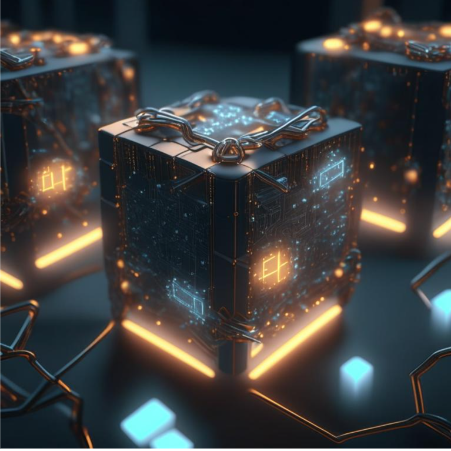
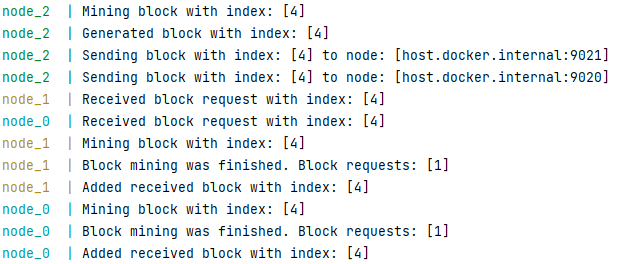

# Basic BlockChain


<sub><sup>*Картинка сгенерирована нейронной сетью</sub></sup>

Базовая реализация блокчейна из 3 нод.

## Как запускать
1. Собрать докер образ<br />
```
docker build -t blockchain_node:latest .
```
2. Запустить через docker-compose<br />
```
docker-compose up
```

## Демонстрация работы



Между нодами происходит обмен блоками